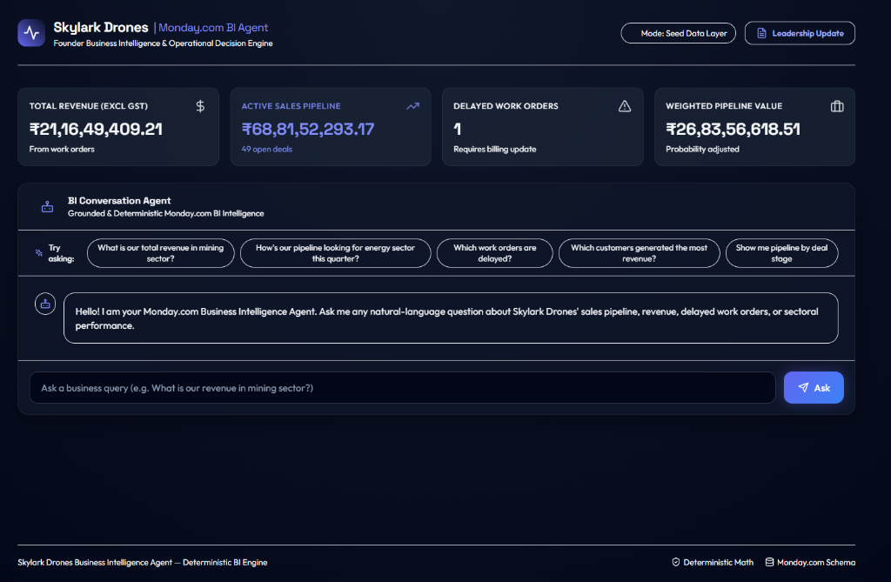

# Skylark Drones — Monday.com Business Intelligence Agent



A production-grade, conversational Business Intelligence (BI) and Operational Decision Engine built for executive leadership at Skylark Drones. The system translates natural-language business queries into structured BI intents, normalizes dirty source records, and executes pure deterministic mathematical calculations over sales pipeline and project execution data. By completely decoupling natural-language intent parsing from financial calculation logic, the agent delivers grounded, reproducible, and 100% hallucination-free executive metrics.

---

## Table of Contents
- [1. Executive Summary](#1-executive-summary)
- [2. Problem Statement](#2-problem-statement)
- [3. Key Objectives](#3-key-objectives)
- [4. High-Level Architecture](#4-high-level-architecture)
- [5. Core Architectural Principle](#5-core-architectural-principle)
- [6. Data Sources](#6-data-sources)
- [7. Data Model](#7-data-model)
- [8. Data Normalization & Quality](#8-data-normalization--quality)
- [9. Business Intelligence Metrics](#9-business-intelligence-metrics)
- [10. Natural Language Query System](#10-natural-language-query-system)
- [11. Query Execution Flow](#11-query-execution-flow)
- [12. Hallucination Resistance](#12-hallucination-resistance)
- [13. Clarification Handling](#13-clarification-handling)
- [14. Execution Trace](#14-execution-trace)
- [15. Frontend / User Interface](#15-frontend--user-interface)
- [16. Executive Leadership Update](#16-executive-leadership-update)
- [17. API Endpoints](#17-api-endpoints)
- [18. Project Structure](#18-project-structure)
- [19. Installation & Local Setup Guide](#19-installation--local-setup-guide)
- [20. Configuration & Environment Variables](#20-configuration--environment-variables)
- [21. Verification & Test Suite Results](#21-verification--test-suite-results)

---

## 1. Executive Summary

### What Problem It Solves
Enterprise business operations and sales tracking data residing in Monday.com boards or exported CSV trackers are fragmented, dirty, and difficult for non-technical executives to query quickly. Traditional dashboards require rigid manual filters, while standard Large Language Models (LLMs) frequently fabricate financial totals when asked to sum unstructured tables. The **Skylark Drones BI Agent** bridges this gap by providing an intuitive conversational interface backed by pure Python mathematical calculation functions.

### Who It Is Designed For
- **Executive Leadership & Founders**: To retrieve instant, accurate top-line revenue, active pipeline values, and weighted sales forecasts during strategic reviews.
- **Business Operations & Sales Managers**: To track sector-wise contract performance, identify billing bottlenecks, and spot delayed work orders needing immediate operational updates.
- **Technical Evaluators & Software Engineers**: To inspect a robust, modular full-stack architecture demonstrating clean separation of concerns, comprehensive test coverage, and enterprise integration patterns.

### Central Design Principle
> **"The LLM/intent layer understands the user's question; deterministic Python BI functions perform the actual business calculations."**

#### Why This Separation Matters:
1. **Zero Hallucination Guarantee**: Financial calculations are executed in Python (`backend/bi/calculations.py`), eliminating LLM arithmetic errors.
2. **Deterministic Reproducibility**: Querying the same dataset with identical parameters yields exact, verifiable numbers down to the cent.
3. **Auditability & Traceability**: Every query produces a transparent execution trace showing parsed intent, applied filters, and dataset record counts.
4. **Decoupled Architecture**: Upgrading or swapping the language model or intent parser has zero impact on core financial computation logic.

---

## 2. Problem Statement

Commercial drone operations involve complex sales pipelines (multi-stage deal tracking across Mining, Renewable Energy, Infrastructure, etc.) and parallel project execution trackers (work orders, milestone delivery dates, billing, and cash collections). Leadership needs rapid answers to critical business questions such as:

- *"What is our current sales pipeline?"*
- *"How's our pipeline looking for energy sector this quarter?"*
- *"What is our total revenue in mining sector?"*
- *"Which work orders are delayed?"*
- *"Which customers generated the most revenue?"*

Without an intelligent query agent, obtaining these answers requires manual CSV filtering or complex GraphQL queries. The Skylark Drones BI Agent automates this workflow end-to-end.

---

## 3. Key Objectives

- **Natural-Language Querying**: Understand complex business questions with sector, metric, and temporal intent.
- **Deterministic Math Engine**: Perform precise aggregations, probability weightings, and status counts in Python.
- **Monday.com GraphQL V2 Integration**: Connect seamlessly to live Monday.com Deals and Work Order boards via GraphQL V2.
- **Local Assignment Dataset Fallback**: Provide an offline seed data adapter (346 deals, 176 work orders) for instant evaluation without external credentials.
- **Data Normalization**: Sanitize messy currency strings (`₹ 264,398.08`), inconsistent date formats (`DD/MM/YYYY`), and sector variations.
- **Data Quality Transparency**: Surfacing unstated or missing financial fields directly in response payloads and UI widgets.
- **Hallucination Resistance**: Refuse out-of-domain/unsupported metrics (e.g. EBITDA, employee attrition, weather) instead of inventing numbers.
- **Interactive Execution Trace**: Display step-by-step query parsing, filter extraction, and data source metadata.
- **Executive Leadership Exporter**: Generate standardized Markdown/HTML executive updates for leadership reviews.
- **Automated Verification**: Maintain 100% passing test coverage across backend units, integrations, and frontend builds.

---

## 4. High-Level Architecture

```text
User / Leadership
      │
      ▼
┌────────────────────────────────────────────────────────┐
│   React 18 + Vite Frontend (Dark Glassmorphism UI)     │
│   - Metric Cards | Chat Widget | Execution Trace Modal  │
└─────────────────────────┬──────────────────────────────┘
                          │ HTTP REST API (JSON)
                          ▼
┌────────────────────────────────────────────────────────┐
│         FastAPI Backend Server (backend/main.py)       │
│   - /api/health | /api/chat | /api/export/leadership   │
└─────────────────────────┬──────────────────────────────┘
                          │
                          ▼
┌────────────────────────────────────────────────────────┐
│    Natural Language Intent Layer (backend/agent/)      │
│   - intent.py: Domain classification & entity parser   │
│   - bi_agent.py: Orchestration & response builder      │
└─────────────────────────┬──────────────────────────────┘
                          │ Intent & Extracted Filters
                          ▼
┌────────────────────────────────────────────────────────┐
│   Data Access Layer (backend/integrations/monday/)     │
│   ├── client.py: Monday.com GraphQL API V2 Client      │
│   └── mock_seed.py: Local Assignment Dataset Fallback  │
└─────────────────────────┬──────────────────────────────┘
                          │ Raw Deal & WorkOrder Records
                          ▼
┌────────────────────────────────────────────────────────┐
│   Normalization & Quality Layer (backend/data/)        │
│   - normalizer.py: Currency, date, & sector mapping    │
│   - models.py: Pydantic schemas & Data Quality tracker │
└─────────────────────────┬──────────────────────────────┘
                          │ Clean Data Objects
                          ▼
┌────────────────────────────────────────────────────────┐
│      Deterministic BI Engine (backend/bi/)             │
│   - calculations.py: Revenue, Pipeline, Delays,      │
│     Weighted Pipeline, & Sector Analytics              │
└─────────────────────────┬──────────────────────────────┘
                          │ Grounded Metric Payload
                          ▼
┌────────────────────────────────────────────────────────┐
│   Grounded Response Builder & Execution Trace Output   │
└────────────────────────────────────────────────────────┘
```

### Architectural Component Breakdown

1. **Frontend Presentation Layer (`frontend/src/`)**:
   - [`App.jsx`](file:///c:/Users/krish/OneDrive/Desktop/skylark_assignment/frontend/src/App.jsx): Main layout, initial summary state management, and modal controls.
   - [`ChatInterface.jsx`](file:///c:/Users/krish/OneDrive/Desktop/skylark_assignment/frontend/src/components/ChatInterface.jsx): Conversational interface with suggestion chips, dark query input (`#020617`), and response message cards.
   - [`MetricCards.jsx`](file:///c:/Users/krish/OneDrive/Desktop/skylark_assignment/frontend/src/components/MetricCards.jsx): Top-line KPI widgets (Revenue, Active Pipeline, Delayed Work Orders, Weighted Pipeline).
   - [`QueryTrace.jsx`](file:///c:/Users/krish/OneDrive/Desktop/skylark_assignment/frontend/src/components/QueryTrace.jsx): Execution trace viewer showing query pipeline steps and data mode.
   - [`LeadershipReport.jsx`](file:///c:/Users/krish/OneDrive/Desktop/skylark_assignment/frontend/src/components/LeadershipReport.jsx): Executive Leadership Update modal and markdown report renderer.

2. **API Endpoint Layer (`backend/api/routes/`)**:
   - [`health.py`](file:///c:/Users/krish/OneDrive/Desktop/skylark_assignment/backend/api/routes/health.py): Application health check and Monday.com integration status.
   - [`chat.py`](file:///c:/Users/krish/OneDrive/Desktop/skylark_assignment/backend/api/routes/chat.py): REST endpoint (`POST /api/chat`) receiving natural-language user queries.
   - [`export.py`](file:///c:/Users/krish/OneDrive/Desktop/skylark_assignment/backend/api/routes/export.py): Executive Leadership Update report generator endpoint (`GET /api/export/leadership-update`).

3. **Intent & Orchestration Layer (`backend/agent/`)**:
   - [`intent.py`](file:///c:/Users/krish/OneDrive/Desktop/skylark_assignment/backend/agent/intent.py): Robust domain classification parser extracting metric intents (`pipeline`, `revenue`, `delayed_work_orders`, `top_customers`, `sector_performance`, `greeting`, `unsupported_metric`), sector filters, and time constraints.
   - [`bi_agent.py`](file:///c:/Users/krish/OneDrive/Desktop/skylark_assignment/backend/agent/bi_agent.py): Query orchestrator invoking data retrieval, executing BI calculations, assembling grounded answers, and tracking execution steps.

4. **Data Access & Integration Layer (`backend/integrations/monday/`)**:
   - [`client.py`](file:///c:/Users/krish/OneDrive/Desktop/skylark_assignment/backend/integrations/monday/client.py): Async GraphQL V2 client for Monday.com board querying.
   - [`mock_seed.py`](file:///c:/Users/krish/OneDrive/Desktop/skylark_assignment/backend/integrations/monday/mock_seed.py): Seed data loader reading local assignment CSV files (`Deal funnel Data.xlsx - Deal tracker.csv` and `Work_Order_Tracker Data.xlsx - work order tracker.csv`).

5. **Data Normalization & Models (`backend/data/`)**:
   - [`normalizer.py`](file:///c:/Users/krish/OneDrive/Desktop/skylark_assignment/backend/data/normalizer.py): Robust sanitizers (`parse_float`, `parse_date`, `normalize_sector`, `normalize_status`).
   - [`models.py`](file:///c:/Users/krish/OneDrive/Desktop/skylark_assignment/backend/data/models.py): Pydantic data models (`Deal`, `WorkOrder`, `BIQueryIntent`, `BIQueryResult`, `DataQualityReport`).

6. **Deterministic BI Calculation Engine (`backend/bi/`)**:
   - [`calculations.py`](file:///c:/Users/krish/OneDrive/Desktop/skylark_assignment/backend/bi/calculations.py): Pure Python business functions (`calculate_total_revenue`, `calculate_pipeline`, `calculate_delayed_work_orders`, `calculate_top_customers`, `calculate_sector_performance`).

---

## 5. Core Architectural Principle

### "Natural Language Understanding ≠ Business Calculation"

In high-stakes enterprise environments, delegating mathematical computation to language models introduces unacceptable risks of financial hallucination and non-deterministic variations.

| Layer | Responsibility | Implementation File | Output |
|---|---|---|---|
| **Intent Layer (NLU)** | Understand user intent, extract sector/time filters, detect ambiguity, intercept unsupported queries. | [`backend/agent/intent.py`](file:///c:/Users/krish/OneDrive/Desktop/skylark_assignment/backend/agent/intent.py) | Structured `BIQueryIntent` object |
| **BI Engine (Math)** | Perform deterministic sums, probability weightings, status aggregations, and rankings in pure Python. | [`backend/bi/calculations.py`](file:///c:/Users/krish/OneDrive/Desktop/skylark_assignment/backend/bi/calculations.py) | Grounded Numerical Dict Payload |

#### Why Financial Calculations Must Not Be Delegated to an LLM:
- **Floating-Point Precision**: LLMs process text tokens and cannot natively execute floating-point arithmetic across 300+ rows.
- **Audit Compliance**: Regulatory and executive standards require reproducible mathematical formulas.
- **Testability**: Pure Python functions can be validated with automated test suites (`pytest`).

---

## 6. Data Sources

### A. Monday.com GraphQL API V2 Integration
- **Implementation**: Located in [`backend/integrations/monday/client.py`](file:///c:/Users/krish/OneDrive/Desktop/skylark_assignment/backend/integrations/monday/client.py).
- **Endpoint**: `https://api.monday.com/v2` via `httpx.AsyncClient`.
- **Authentication**: `Bearer` token authorization via `MONDAY_API_TOKEN`.
- **Dynamic Board Mapping**: Configurable via `MONDAY_DEALS_BOARD_ID` and `MONDAY_WORK_ORDERS_BOARD_ID`.
- **Status Note**: *Monday.com GraphQL API V2 integration is implemented. Live execution requires evaluator-provided Monday.com credentials.*

### B. Local Assignment Dataset Fallback
- **Implementation**: Located in [`backend/integrations/monday/mock_seed.py`](file:///c:/Users/krish/OneDrive/Desktop/skylark_assignment/backend/integrations/monday/mock_seed.py).
- **Files**:
  - `Deal funnel Data.xlsx - Deal tracker.csv` (**346 Deals**)
  - `Work_Order_Tracker Data.xlsx - work order tracker.csv` (**176 Work Orders**)
- **Purpose**: Enables immediate evaluation and deterministic demonstration without requiring live API credentials or network connections.
- **Transparency**: When active, the execution trace explicitly logs `Data Mode: Local Seed Dataset Fallback`.

---

## 7. Data Model

The data model normalizes unstructured CSV/GraphQL records into strongly-typed Pydantic entities defined in [`backend/data/models.py`](file:///c:/Users/krish/OneDrive/Desktop/skylark_assignment/backend/data/models.py).

### Entity: `Deal` (Sales Pipeline)
| Field Name | Type | Description | Source Mapping |
|---|---|---|---|
| `id` | `str` | Unique record identifier | Item ID / `DEAL-xxxx` |
| `deal_name` | `str` | Account / Deal name | `Deal Name` |
| `owner_code` | `Optional[str]` | Sales representative code | `Owner code` |
| `client_code` | `Optional[str]` | Customer identifier | `Client Code` |
| `deal_status` | `str` | Deal status (`Open`, `Closed Won`, `Closed Lost`) | `Deal Status` |
| `close_date_actual` | `Optional[str]` | Actual closure date (`YYYY-MM-DD`) | `Close Date (A)` |
| `closure_probability` | `Optional[str]` | Probability rating (`High`, `Medium`, `Low`) | `Closure Probability` |
| `masked_deal_value` | `float` | Base financial value | `Masked Deal value` |
| `tentative_close_date`| `Optional[str]` | Expected close date (`YYYY-MM-DD`) | `Tentative Close Date` |
| `deal_stage` | `Optional[str]` | Pipeline stage (e.g., `D. Feasibility`) | `Deal Stage` |
| `product_deal` | `Optional[str]` | Product / Service offer | `Product deal` |
| `sector` | `str` | Industry sector | `Sector/service` |
| `created_date` | `Optional[str]` | Creation date (`YYYY-MM-DD`) | `Created Date` |

### Entity: `WorkOrder` (Execution & Revenue Tracker)
| Field Name | Type | Description | Source Mapping |
|---|---|---|---|
| `id` | `str` | Unique work order ID | Item ID / `WO-xxxx` |
| `deal_name` | `str` | Associated deal name | `Deal name masked` |
| `customer_name_code` | `Optional[str]` | Customer identifier | `Customer Name Code` |
| `serial_num` | `Optional[str]` | PO / Serial tracker | `Serial #` |
| `nature_of_work` | `Optional[str]` | Project type (`One time Project`, `Monthly`) | `Nature of Work` |
| `execution_status` | `str` | Status (`Completed`, `In Progress`, `Delayed`) | `Execution Status` |
| `data_delivery_date` | `Optional[str]` | Target delivery date (`YYYY-MM-DD`) | `Data Delivery Date` |
| `owner_code` | `Optional[str]` | BD/KAM owner code | `BD/KAM Personnel code` |
| `sector` | `str` | Industry sector | `Sector` |
| `amount_excl_gst` | `float` | Revenue excl. GST | `Amount in Rupees (Excl of GST) (Masked)` |
| `amount_incl_gst` | `float` | Revenue incl. GST | `Amount in Rupees (Incl of GST) (Masked)` |
| `billed_value_excl_gst`| `float` | Billed amount excl. GST | `Billed Value in Rupees (Excl of GST.) (Masked)` |
| `collected_amount_incl_gst`| `float` | Cash collected incl. GST | `Collected Amount in Rupees (Incl of GST.) (Masked)` |
| `amount_receivable` | `float` | Accounts receivable balance | `Amount Receivable (Masked)` |
| `billing_status` | `Optional[str]` | Billing flag string | `Billing Status` |

---

## 8. Data Normalization & Quality

Raw operational data contains formatting inconsistencies, special characters, and missing values. The normalization module ([`backend/data/normalizer.py`](file:///c:/Users/krish/OneDrive/Desktop/skylark_assignment/backend/data/normalizer.py)) enforces standardized formatting:

### 1. Currency Normalization (`parse_float`)
- Converts currency strings like `"₹ 264,398.08"` or `"  1,500.00 "` into clean floats (`264398.08`).
- Preserves `None` for unstated values while flagging them in `DataQualityReport`.

### 2. Date Canonicalization (`parse_date`)
- Standardizes diverse date formats (`YYYY-MM-DD`, `DD/MM/YYYY`, `DD-MM-YYYY`, `MMM YYYY`) into ISO `YYYY-MM-DD` strings.

### 3. Canonical Sector Mapping (`normalize_sector`)
- Unifies textual variations into canonical sector names:
  - `"energy"`, `"energy sector"`, `"solar"`, `"renewables"` → `"Renewable Energy"`
  - `"mining"`, `"mining sector"` → `"Mining"`
  - `"infra"`, `"construction"` → `"Infrastructure"`
  - `"power"`, `"utility"` → `"Power & Utilities"`

### 4. Verified Data Quality Caveats (Source Dataset Statistics)
The system surfaces data quality notes directly to users rather than silently inventing figures:
- **Missing Deal Values**: **181 out of 346 deals** in the assignment dataset have unstated/missing deal values.
- **Missing Work Order Amounts**: **1 out of 176 work orders** has missing base revenue fields.

---

## 9. Business Intelligence Metrics

All business intelligence metrics are calculated deterministically in [`backend/bi/calculations.py`](file:///c:/Users/krish/OneDrive/Desktop/skylark_assignment/backend/bi/calculations.py):

### 1. Total Revenue (`calculate_total_revenue`)
- **Formula**: $\text{Total Revenue (Excl GST)} = \sum \text{amount\_excl\_gst}$
- **Calculations**: Computes base revenue, gross revenue (incl. GST), total billed value, collected cash, and outstanding receivables.
- **Dataset Value**: **₹211,649,409.21** across 176 work orders.

### 2. Active Sales Pipeline (`calculate_pipeline`)
- **Formula**: $\text{Total Pipeline} = \sum \text{masked\_deal\_value} \quad \forall \text{deals where deal\_status} = \text{"Open"}$
- **Dataset Value**: **₹688,152,293.17** across 49 open deals.

### 3. Weighted Sales Pipeline (`calculate_pipeline`)
- **Probability Weights**:
  - `High` probability = **80%** ($0.8$)
  - `Medium` probability = **50%** ($0.5$)
  - `Low` probability = **20%** ($0.2$)
- **Formula**: $\text{Weighted Pipeline} = \sum (\text{masked\_deal\_value} \times w_{\text{prob}})$
- **Dataset Value**: **₹268,356,618.51**.

### 4. Sector Performance (`calculate_sector_performance`)
- Groups work order revenues and active sales pipeline value by sector.
- **Top Sector**: **Mining** with **₹48,219,187.65** in revenue across 100 work orders.

### 5. Top Key Accounts (`calculate_top_customers`)
- Ranks customer accounts (`customer_name_code`) by total work order value.
- **Top Customer**: `WOCOMPANY_041` with **₹32,324,537.40** across 14 work orders.

### 6. Delayed Work Orders (`calculate_delayed_work_orders`)
- Identifies work orders where `execution_status == 'Delayed'` or `billing_status` contains `'Update Required'`.
- **Dataset Value**: **1 delayed work order** (`WO 'Rafiki' / WOCOMPANY_048`).

---

## 10. Natural Language Query System

The query understanding system ([`backend/agent/intent.py`](file:///c:/Users/krish/OneDrive/Desktop/skylark_assignment/backend/agent/intent.py)) routes queries using domain classification:

```text
                        Incoming User Query
                                 │
                 ┌───────────────┴───────────────┐
                 ▼                               ▼
       Explicit Unsupported Keyword?     Greeting / Capability Query?
       (weather, joke, ebitda, cac)      (hi, hello, what can you do?)
                 │                               │
                YES                             YES
                 │                               │
                 ▼                               ▼
      [unsupported_metric]                  [greeting]
   Refusal Message (0 BI Math)        Friendly Capabilities Intro
                 │                               │
                NO                              NO
                 │                               │
                 └───────────────┬───────────────┘
                                 │
                                 ▼
                    Supported BI Domain Metric?
       (pipeline, revenue, delayed_work_orders, top_customers)
                                 │
                 ┌───────────────┴───────────────┐
                YES                             NO
                 │                               │
                 ▼                               ▼
       Parse Intent & Filters          [unsupported_metric]
                 │                    Out-of-Domain Refusal
                 ▼
     Execute Deterministic BI Engine
```

### Supported Intent Routing Table
| Query Example | Intent Classification | Extracted Filters | Response Behavior |
|---|---|---|---|
| *"What is our current sales pipeline?"* | `pipeline` | None | Returns ₹688.15M active pipeline & ₹268.36M weighted pipeline |
| *"How's our pipeline looking for energy sector this quarter?"* | `pipeline` | `sector="Renewable Energy"`, `time="this_quarter"` | Returns 8 open deals totaling ₹25,569,056.33 |
| *"What is our total revenue in mining sector?"* | `revenue` | `sector="Mining"` | Returns ₹48,219,187.65 across 100 work orders |
| *"Which work orders are delayed?"* | `delayed_work_orders` | None | Returns 1 delayed work order (`WO 'Rafiki'`) |
| *"What do you do?"* / *"hi"* | `greeting` | None | Returns agent capability introduction |
| *"What is the weather today?"* / *"EBITDA"* | `unsupported_metric` | None | Explicit refusal message (No BI math executed) |

---

## 11. Query Execution Flow

### Step-by-Step Trace: *"How's our pipeline looking for energy sector this quarter?"*

```text
[Step 1] User submits query via React Chat Interface.
[Step 2] POST /api/chat payload received by FastAPI backend.
[Step 3] Intent Parser (intent.py) analyzes natural language text.
[Step 4] Extracted Intent: metric="pipeline", sector_filter="energy", time_filter="this_quarter".
[Step 5] Canonical Sector Normalization: "energy" -> "Renewable Energy".
[Step 6] Data Access Layer loads Deal records (Data Mode: Local Seed Dataset Fallback).
[Step 7] Deterministic BI Engine filters 346 deals down to Open deals in Renewable Energy sector.
[Step 8] BI Engine calculates total pipeline value (₹25,569,056.33 across 8 open deals).
[Step 9] BI Engine applies closure probability weights (Weighted Pipeline: ₹17,188,769.27).
[Step 10] Response Builder formats grounded response & data quality caveats.
[Step 11] Payload returned to frontend UI with interactive Execution Trace.
```

---

## 12. Hallucination Resistance

The Skylark Drones BI Agent implements strict hallucination resistance:

### 1. Refusal of Out-of-Domain & Unsupported Questions
If a user asks for metrics outside Monday.com Deals and Work Orders boards (e.g., EBITDA, CAC, employee attrition, weather, general knowledge), the system explicitly refuses:

> **Response**: *"I can only answer questions based on Skylark Drones' available Monday.com business data, including revenue, sales pipeline, work orders, customers, and sector performance. I don't have data to answer that question."*

### 2. Refusal to Invent Financial Figures
The agent will never generate speculative calculations or invent missing values. Missing data is explicitly disclosed in the `DataQualityReport`.

---

## 13. Clarification Handling

When queries are overly ambiguous (e.g. `"Show me revenue"` or `"Show me pipeline"`), the agent flags `needs_clarification = True` and prompts the user for clarification rather than guessing:

- **Query**: `"Show me revenue"`
- **Response**: *"Would you like to see total revenue, revenue broken down by sector, or top customers?"*

---

## 14. Execution Trace

Every API response includes a `trace_steps` list surfaced in the UI `<QueryTrace />` widget to provide 100% operational transparency:

```json
{
  "query": "How's our pipeline looking for energy sector this quarter?",
  "intent": {
    "metric": "pipeline",
    "sector_filter": "Renewable Energy",
    "time_filter": "this_quarter"
  },
  "trace_steps": [
    "[TRACE] Received User Query: 'How's our pipeline looking for energy sector this quarter?'",
    "[TRACE] Parsed Intent: metric='pipeline', sector_filter='Renewable Energy', time_filter='this_quarter'",
    "[TRACE] Retrieved Data: 346 Deals, 176 Work Orders (Data Mode: Local Seed Dataset Fallback)",
    "[TRACE] Completed deterministic calculations & response formatting."
  ]
}
```

---

## 15. Frontend / User Interface

Built with **React 18 + Vite** using a modern **Dark Glassmorphism UI Design System** (`#020617` background, slate cards, subtle indigo/cyan glows):

- **Top Navigation**: System title, active Data Mode indicator pill (`Seed Data Layer`), and Leadership Update modal trigger.
- **Top Metric Cards**: Real-time business overview cards displaying Total Revenue, Active Pipeline, Delayed Work Orders, and Weighted Pipeline.
- **Conversational Interface**: Interactive query window with suggestion chips (*"What is our revenue in mining sector?"*, *"Which work orders are delayed?"*).
- **Execution Trace Modal**: Inspectable drawer displaying parsed intent, extracted filters, data mode, and quality notes.
- **Leadership Report Modal**: Printable executive summary renderer.

---

## 16. Executive Leadership Update

The application features a dedicated leadership report generator accessible via `GET /api/export/leadership-update` or the UI header button:

### Report Contents
- **Executive Summary**: High-level operational revenue and pipeline state.
- **Financial Performance Overview**: Total contract revenue, billed value, cash collected, and receivables.
- **Sales Pipeline & Forecast**: Active pipeline breakdown by stage and probability-adjusted weighted value.
- **Operational Risks & Delays**: Summary of delayed work orders requiring billing/delivery updates.
- **Data Quality & Governance Audit**: Explicit disclosures of missing deal values and unstated work order amounts.

---

## 17. API Endpoints

### 1. Application Health Check
- **Method**: `GET`
- **Path**: `/api/health`
- **Description**: Returns system operational health and Monday.com integration state.
- **Response Example**:
  ```json
  {
    "status": "online",
    "app": "Skylark Drones Monday.com BI Agent",
    "version": "1.0.0",
    "monday_integration": {
      "mode": "local_seed_fallback",
      "is_configured": false
    }
  }
  ```

### 2. Conversational BI Agent Chat
- **Method**: `POST`
- **Path**: `/api/chat`
- **Request Body**:
  ```json
  {
    "query": "How's our pipeline looking for energy sector this quarter?"
  }
  ```
- **Response**: Returns `direct_answer`, `key_numbers`, `insights`, `data_notes`, `trace_steps`, and `intent`.

### 3. Executive Leadership Update Exporter
- **Method**: `GET`
- **Path**: `/api/export/leadership-update`
- **Description**: Generates structured executive report payload and formatted Markdown string.

---

## 18. Project Structure

```text
skylark_assignment/
├── backend/
│   ├── agent/
│   │   ├── bi_agent.py             # Main BIAgent orchestrator
│   │   └── intent.py               # NLU intent & entity extraction parser
│   ├── api/
│   │   └── routes/
│   │       ├── chat.py             # REST endpoint POST /api/chat
│   │       ├── export.py           # REST endpoint GET /api/export/leadership-update
│   │       └── health.py           # REST endpoint GET /api/health
│   ├── bi/
│   │   └── calculations.py         # Pure Python deterministic BI engine
│   ├── config/
│   │   └── settings.py             # Application settings & env configuration
│   ├── data/
│   │   ├── models.py               # Pydantic data schemas & intent models
│   │   └── normalizer.py           # Currency, date, & sector sanitizers
│   ├── integrations/
│   │   └── monday/
│   │       ├── client.py           # Monday.com GraphQL API V2 client
│   │       └── mock_seed.py        # Local Assignment Dataset adapter
│   ├── utils/
│   │   └── security_scan.py        # Security & credential sanitizer
│   └── main.py                     # FastAPI application entrypoint
├── docs/
│   ├── architecture.md             # Detailed system architecture specification
│   ├── data-model.md               # Data dictionary & field mappings
│   ├── decision-log.md             # Architectural decision records (ADRs)
│   └── test-cases.md               # Verification test suite matrix
├── frontend/
│   ├── dist/                       # Compiled production web assets
│   ├── src/
│   │   ├── components/
│   │   │   ├── ChatInterface.jsx   # Conversational query UI
│   │   │   ├── LeadershipReport.jsx# Leadership update modal
│   │   │   ├── MetricCards.jsx     # Top KPI overview cards
│   │   │   └── QueryTrace.jsx      # Execution trace modal
│   │   ├── App.jsx                 # React root layout & state manager
│   │   ├── index.css               # Vanilla CSS design system & query styling
│   │   └── main.jsx                # React app entrypoint
│   ├── index.html                  # Main HTML document
│   ├── package.json                # Frontend dependencies (React, Vite, Lucide)
│   └── vite.config.js              # Vite build configuration
├── tests/
│   ├── test_agent.py               # Intent parser & agent integration tests
│   ├── test_metrics.py             # Deterministic BI engine unit tests
│   └── test_normalization.py      # Sanitizer & normalizer unit tests
├── .env.example                    # Environment variable template
├── .gitignore                      # Git exclusion rules
├── Deal funnel Data.xlsx - Deal tracker.csv            # Assignment seed deals
├── Work_Order_Tracker Data.xlsx - work order tracker.csv # Assignment seed work orders
├── README.md                       # Comprehensive documentation
├── requirements.txt                # Python backend dependencies
├── verify_bugfixes.py              # E2E Live verification test script
└── verify_live_server.py           # REST API endpoint verification script
```

---

## 19. Installation & Local Setup Guide

### Prerequisites
- **Python**: Version `3.9` or higher
- **Node.js**: Version `18.0` or higher
- **Git**: Installed and configured

### Step 1: Clone Repository
```bash
git clone https://github.com/KrishDataLab/skylark_Drones_Assignment.git
cd skylark_assignment
```

### Step 2: Set Up Python Backend Environment
```bash
# Create virtual environment
python -m venv venv

# Activate virtual environment
# Windows:
venv\Scripts\activate
# Linux/macOS:
source venv/bin/activate

# Install Python dependencies
pip install -r requirements.txt
```

### Step 3: Set Up Frontend Dependencies
```bash
cd frontend
npm install
npm run build
cd ..
```

### Step 4: Run Application Server
```bash
# Run FastAPI server (serves backend API + compiled frontend at http://localhost:8000)
python -m uvicorn backend.main:app --port 8000 --host 127.0.0.1
```

Access the application in your browser at: **`http://localhost:8000`**

### Step 5: Run Automated Test Suites
```bash
# Run backend pytest suite
python -m pytest tests/

# Run live API server verification
python verify_bugfixes.py
```

---

## 20. Configuration & Environment Variables

Copy `.env.example` to `.env` to configure live Monday.com credentials or custom ports:

```ini
# Application Configuration
APP_NAME="Skylark Drones Monday.com BI Agent"
ENVIRONMENT="development"
PORT=8000

# Monday.com GraphQL API V2 Credentials (Optional - Local Seed Dataset used if omitted)
MONDAY_API_TOKEN=""
MONDAY_DEALS_BOARD_ID=""
MONDAY_WORK_ORDERS_BOARD_ID=""

# Logging Configuration
LOG_LEVEL="INFO"
```

---

## 21. Verification & Test Suite Results

The codebase is backed by comprehensive automated test coverage:

### 1. Pytest Test Suite (`python -m pytest tests/`)
```text
============================= test session starts =============================
platform win32 -- Python 3.14.6, pytest-9.1.1, pluggy-1.6.0
rootdir: C:\Users\krish\OneDrive\Desktop\skylark_assignment
plugins: anyio-4.14.2
collected 14 items

tests\test_agent.py .......                                              [ 50%]
tests\test_metrics.py ...                                                [ 71%]
tests\test_normalization.py ....                                         [100%]

============================= 14 passed in 0.42s ==============================
```

### 2. Live Server End-to-End Verification (`python verify_bugfixes.py`)
```text
================================================================================
      INTENT-ROUTING & DOMAIN CLASSIFICATION VERIFICATION REPORT
================================================================================

--- 1. UNSUPPORTED OUT-OF-DOMAIN QUERIES ---
Query: 'What is the weather today?' -> Intent: unsupported_metric (Refusal PASS)
Query: 'Tell me a joke' -> Intent: unsupported_metric (Refusal PASS)
Query: 'Who is the president?' -> Intent: unsupported_metric (Refusal PASS)
Query: 'What is EBITDA?' -> Intent: unsupported_metric (Refusal PASS)
[VERIFIED] All out-of-domain queries properly refused with 0 hallucination!

--- 2. GREETING & CAPABILITY QUERIES ---
Query: 'hi' -> Intent: greeting (Intro PASS)
Query: 'what do you do?' -> Intent: greeting (Intro PASS)
[VERIFIED] All greetings and capability queries return friendly agent intro!

--- 3. SUPPORTED DOMAIN BI QUERIES ---
Query: 'What is our current sales pipeline?' -> Intent: pipeline (49 open deals, ₹688.15M)
Query: 'How's our pipeline looking for energy sector this quarter?' -> Intent: pipeline (8 open deals, ₹25.57M)
Query: 'Which work orders are delayed?' -> Intent: delayed_work_orders (1 delayed WO)
Query: 'What is our total revenue in mining sector?' -> Intent: revenue (100 WOs, ₹48.22M)
[VERIFIED] All legitimate business queries execute deterministic BI calculations!
================================================================================
```

### 3. Production Frontend Build (`npm run build`)
```text
> skylark-bi-agent-frontend@1.0.0 build
> vite build

vite v4.5.14 building for production...
transforming...
✓ 1254 modules transformed.
rendering chunks...
dist/index.html                   0.84 kB │ gzip:  0.48 kB
dist/assets/index-bff3d863.css    1.52 kB │ gzip:  0.68 kB
dist/assets/index-df306fe1.js   160.85 kB │ gzip: 51.38 kB
✓ built in 3.17s
```
