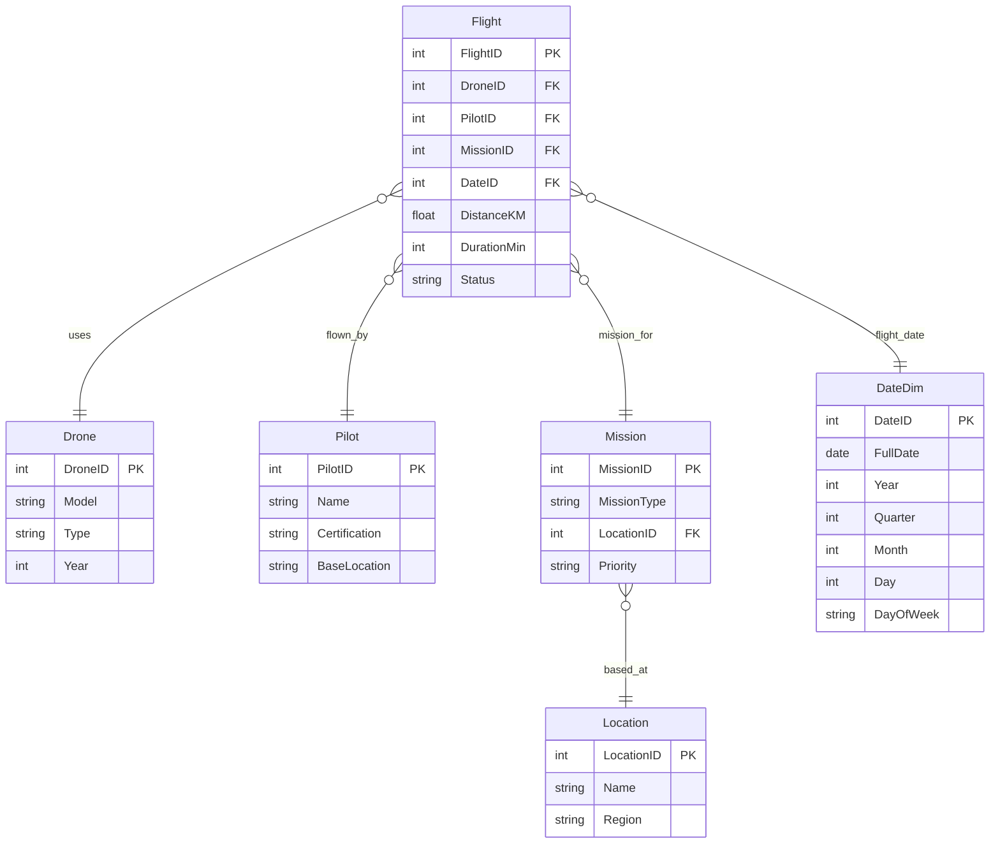
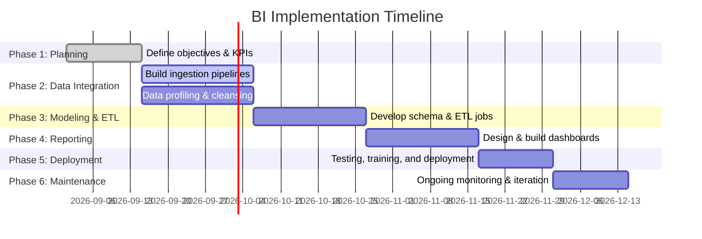

# Executive Summary  
Skylark Drones needs a modern BI solution to turn its operational and sensor data into actionable insights. Our approach builds a scalable data pipeline and analytics platform: integrating flight logs, telemetry, maintenance, and external data (e.g. weather, GIS) into a unified model. We recommend a cloud-based data warehouse/lakehouse, an ELT architecture using proven tools (e.g. cloud ETL services, Spark/SQL pipelines), and a dimensional model (star schema) for fast analytical queries. Key deliverables include dashboards with operational KPIs (missions completed, drone utilization, etc.) and success metrics (e.g. ROI, data quality, user adoption). A phased implementation plan (see timeline below) will assign roles (data engineers, BI developers, etc.) and allocate low/medium/high effort and budget based on project scope. Risks (data quality, scope creep) will be mitigated by early profiling and incremental delivery.  

## Business Objectives & Success Metrics  
First, stakeholders must agree on clear objectives and BI goals. For example, Skylark might aim to **improve operational efficiency** (e.g. increase missions per pilot-day), **reduce downtime/costs** (optimize maintenance schedules), or **enhance customer value** (faster delivery, higher satisfaction). Each objective has quantifiable KPIs. We should measure business impact (ROI of BI project, cost savings) and operational KPIs (mission success rate, on-time percentage). As Codeplateau notes, **BI metrics** track system performance and align with goals. Useful KPIs include overall ROI (benefits vs costs), **customer metrics** (e.g. Net Promoter Score), and **process metrics** (missions per period, average mission duration). We also track **data quality metrics** – e.g. error rates, duplicate or missing records, and data freshness – since “inconsistent or inaccurate data can hurt” decisions. Finally, measure **user adoption** (number of dashboard users, reports generated) and **delivery SLAs** (report refresh times) to ensure the BI system is used and reliable. 

## Data Sources and Quality  
### Internal Sources  
Skylark’s internal data likely includes: flight and mission logs (timestamps, GPS traces, distances, outcomes), drone inventory and sensor telemetry, maintenance/repair records, pilot assignments and training logs, sales/contracts data, and financials. These typically reside in transactional systems (SQL/NoSQL databases, CSV exports, etc.). Key fields include `DroneID`, `MissionID`, timestamps, location (lat/lon), sensor readings (battery, camera counts), and status flags. Also consider CRM or warranty databases for customer feedback.  

### External Sources  
External data enriches analysis. For a drone company, relevant data might be **weather data** (API feeds of wind, rain affecting flights), **geospatial/GIS data** (map layers, terrain, no-fly zones), **market data** (industry trends, competitor pricing), and possibly **IoT feeds** (e.g. air traffic or radar). For example, correlating flight delays with weather improves planning.  

### Data Quality Checks  
Ensuring high-quality data is critical. We will build validation tests into the ETL pipeline (ideally *before* loading into the warehouse). Best practices include counting nulls, duplicates, and orphans with SQL-based checks. For instance:  
- **Null/missing checks**: `SELECT COUNT(*) WHERE key_field IS NULL;` (ensure no critical fields are blank).  
- **Duplicate detection**: `SELECT key_field, COUNT(*) FROM table GROUP BY key_field HAVING COUNT(*)>1;` to find duplicate records.  
- **Referential integrity**: Outer-join fact and dimension tables to find orphans (`WHERE parent_id IS NULL`). This is important since some warehouses (BigQuery, Snowflake) don’t enforce FKs.  
- **Timeliness/freshness**: Track last-update timestamps and alert if data arrives late. For example, check that `MAX(timestamp)` is within expected SLA.  

These checks should run early (at staging) and automatically reject or flag bad data. We will log and report all data issues to engineers and fix source anomalies iteratively. This approach aligns with DW/BI risk management best practice: “formal data profiling of all source data early… to understand whether data quality meets project needs”. 

## ETL/ELT Architecture  
We propose an **ELT**-style pipeline in a cloud environment: extract and load raw data into scalable storage, then transform inside the warehouse/lakehouse. This leverages the target platform’s compute power and keeps raw data for auditing. (Per Microsoft: “Choose ELT when your target system is a modern DW or lakehouse with elastic scaling… and you want to preserve raw data”.) Tools may include managed services (e.g. Azure Data Factory, AWS Glue, Google Dataflow) or open-source engines (Apache Spark, Airflow orchestration). For example, IoT flight data could stream into a message queue (Kafka/Azure Event Hubs), ingested by Spark Streaming into Delta Lake (see **Streaming** below). Batch data (daily flight logs, maintenance sheets) could be loaded via scheduled ETL jobs (e.g. Airflow workflows) into a staging area. 

We should support **both batch and streaming**. Batch processing (hours/days) covers large historical loads and nightly aggregations. For near-real-time monitoring (e.g. live flight alerts), streaming is ideal. Streaming pipelines (Kafka or cloud pub/sub → Spark/Flink) process data continuously, providing low-latency updates to dashboards. As Databricks notes, streaming “processes only new data” efficiently but adds complexity for late-arriving data. We will use streaming for critical KPIs (e.g. live drone health), and batch for rest. 

Architecture options:  
- **Cloud ETL vs On-Premises**: We recommend cloud given scalability and maintenance ease. On-premises requires buying/maintaining HW and limits elasticity, whereas cloud DW offers “on-demand scalability, cost efficiency, integrated IAM and high uptime”. (However, if compliance requires local data or extremely low latency, a hybrid model could combine both.)  
- **Tools**: Candidate ETL tools include **Fivetran/Airbyte** (auto-ingest from SaaS sources), **Apache NiFi** or **SSIS** for custom flows, and **dbt** for transformations. We will use version-controlled pipelines with CI/CD.  

## Data Modeling and Schema  
For analytics, we recommend a dimensional (star) schema. A central **Fact** table (e.g. *Flights* or *Missions*) contains numeric measures (distance, duration, cost) and foreign keys to **Dimension** tables (Date, Drone, Pilot, MissionType, Location, etc.). Dimensions provide context (drone model, pilot details, date attributes). A star schema is “simple and fast” for queries: denormalized dimensions mean fewer joins and faster reads. For example, a dimension *Drone* might include DroneID, Model, Type, CommissionDate, etc., while the *Flight* fact holds FlightID, DroneID, PilotID, DateID, Duration, Status, etc.  

A normalized (snowflake) schema could split dimensions (e.g. separating DroneType into its own table), which saves some storage but requires extra joins. Since our priority is query speed and clarity for analysts, we lean toward a star schema. (However, if certain hierarchies are deep, lightly snowflaking may be used to avoid excessive denormalization.) A star schema speeds up queries. For example: 
```
SELECT d.Type, SUM(f.DistanceKM) AS TotalDistance
FROM Flights f
JOIN Drone d ON f.DroneID = d.DroneID
GROUP BY d.Type;
``` 
This mirrors the sales example in [28] where a simple star join yields totals.  


*Figure: Example star-schema ER diagram (mermaid) for Skylark Drones analytics data model.*  

## Storage: Data Warehouse vs Lakehouse  
A **data warehouse** (DW) would host our cleaned, structured data for BI. Warehouses excel at fast SQL queries on structured data. In contrast, a **data lake** (object storage like S3) can hold raw and unstructured data cheaply, but lacks query optimization and governance. A **lakehouse** combines both: it uses low-cost object storage with a metadata/catalog layer for indexing and ACID transactions. Lakehouses (e.g. Databricks Delta Lake, Snowflake, AWS Redshift/Spectrum) allow SQL analytics on raw or curated data and are designed for modern workloads (BI + ML on the same data).  

**Key comparisons**: A DW enforces schema-on-write and structured tables, making it ideal for business users and reporting (data is reliable and fast to query). Data lakes use schema-on-read and store any format, suiting data science. Lakehouses let us enforce schemas and governance like a DW *and* store diverse data types. For example, lakehouses use cloud object storage for scale (as in data lakes) but add a metadata layer for fast queries and quality checks.  

All modern cloud DWs (BigQuery, Redshift, Snowflake) and lakehouses (Databricks, Delta, DuckDB+S3) can auto-scale compute. In practice, we might host curated star-schema tables in a cloud DW for performance, while keeping raw logs in a data lake. Table summarizing these trade-offs:

| Feature            | Data Warehouse           | Data Lake                     | Data Lakehouse                                 |
|--------------------|--------------------------|-------------------------------|-----------------------------------------------|
| Data types         | Structured only | All (structured + unstructured) | All, with support for SQL and schema-on-write |
| Schema approach    | Schema-on-write (strict) | Schema-on-read (flexible)  | Flexible schema, enforceable at read/write |
| Scalability        | Requires sizing or reserved cloud resources | Cloud-native (decoupled storage/compute) | Cloud-native, elastic compute & storage (e.g. Delta Lake) |
| Performance        | Very fast for BI queries (columnar storage) | Slower unless cached/indexed (improving via Presto/Spark) | Fast SQL queries on lake data (Delta/Iceberg optimizations) |
| Use case           | Report/dashboarding on curated data | Big data processing, ML, archives | Unified analytics: BI + ML on same data |

In summary, we recommend a **cloud DW/Lakehouse** for Skylark. For example, Snowflake or BigQuery (with federated tables) or Databricks Delta on AWS/Azure. These provide columnar performance, pay-as-you-go compute, and built-in features (security, governance).  

## BI Tools and Dashboards  
For visualization and reporting, choose a tool that fits Skylark’s ecosystem and users. Leading options include **Microsoft Power BI** (integrates with Azure/M365, user-friendly, very cost-effective), **Tableau** (best-in-class interactive visuals and analytics), **Qlik Sense** (associative data engine for ad-hoc exploration), and **Google Looker/Looker Studio** (cloud-native, strong with Google data and embedded analytics). Cost is a factor: Power BI Pro is ~$10/user/mo (desktop free), Tableau Creator ~$75/user/mo, Qlik Sense ~$30/user/mo, while Looker Studio offers a free tier.  

A comparison table:

| Tool           | License ($/user/mo) | Strengths & Best Use                                                                                                         |
| -------------- | ------------------------------- | ---------------------------------------------------------------------------------------------------------------------------- |
| **Power BI**   | ≈10 (Pro)           | Microsoft ecosystem integration; intuitive interface; cost-effective for all sizes. Best for firms on Azure/Office 365.  |
| **Tableau**    | ≈75 (Creator)       | Industry-leading visual analytics, highly interactive dashboards. Best for complex visual analysis (large enterprises). |
| **Qlik Sense** | ≈30 (per user)     | Associative engine for exploratory analytics; good for large, real-time datasets. Suited to data discovery use. |
| **Looker**     | Free / varied       | Modern, developer-centric with LookML; integrates tightly with Google stack. Good for embedded analytics and Google Cloud shops. |

All these tools support common BI features (role-based access, mobile apps, alerts). Our recommendation: if Skylark already uses Microsoft, Power BI is a strong, budget-friendly choice. If advanced visual analytics are top priority, Tableau could be added.  

Dashboards should present the agreed KPIs in a clear layout. A wireframe mockup is useful in design. For example:  

 *Figure: Example dashboard wireframe layout (illustration)*. In practice, each dashboard page would have **headers/titles**, **filters** (date range, drone type), **KPI cards** (e.g. total missions, avg flight time), and visualizations (charts, maps). An example ASCII mockup:

```
+----------------------------------------------------+
| Skylark Drones: Mission Performance Dashboard       |
+----------------------------------------------------+
| Total Missions: 1,200    | Avg Duration: 45 min    |
| Active Drones: 150       | Avg Drone Uptime: 82%    |
|----------------------------------------------------|
| [Bar Chart: Missions per Region]  [Line Chart: Daily Missions] |
| [Map: Flight Paths]  [Gauge: Fleet Utilization]                   |
+----------------------------------------------------+
```

Each element (chart, gauge, map) will be tied to our data model. Designers should follow BI UI best practices: clear labeling, consistent colors, and user-friendly filters.  

## Implementation Plan and Timeline  
We propose a phased rollout. Key phases (each with roles noted) are:  

1. **Planning & Requirements (Weeks 1–2):** Business analysts and data architects work with stakeholders to finalize objectives, KPIs, and scope. Success metrics and project plan are confirmed.  
2. **Data Ingestion & Staging (Weeks 3–5):** Data engineers connect to internal systems (databases, APIs) and build ingestion pipelines. External data feeds (weather APIs, etc.) are integrated. Data profiling is done to refine quality checks.  
3. **Modeling & ETL Development (Weeks 6–8):** Define schema and create dimensional model; build ETL/ELT pipelines to populate the star schema. Use tools (e.g. dbt, Spark) for transformations. Implement early data validation tests (e.g. row counts, null checks).  
4. **Dashboard Development (Weeks 9–11):** BI developers design and build dashboards for key KPIs. Iteratively review with users, refining visualizations. User training on tools begins.  
5. **Testing, Deployment & Training (Weeks 12–13):** QA test all data flows and reports end-to-end. Conduct user acceptance testing (UAT) and train business users. Deploy solution to production cloud environment.  
6. **Monitoring & Iteration (Ongoing):** Post-launch, monitor data freshness and performance. Gather user feedback for refinements. Implement enhancements or new dashboards as needed.  


*Figure: Gantt timeline of BI project phases.*  

**Roles & Responsibilities:**  
- *Business Analyst/PM:* Gathers requirements, defines KPIs, manages scope and stakeholder communication.  
- *Data Engineer:* Connects data sources, implements ETL/ELT pipelines, ensures data quality.  
- *Data Architect:* Designs the dimensional model and selects technology (warehouse/lakehouse).  
- *BI Developer:* Creates dashboards and reports, defines DAX/MDX measures, builds semantic layer.  
- *QA/Test Engineer:* Validates data accuracy and performance of BI apps.  
- *Data Steward/Analyst:* Validates business logic and interprets results, ensures governance.  

## Effort and Cost Estimates  
Using industry benchmarks, we classify scope as **low/medium/high** complexity:  
- **Low** (simple connectivity to 1–2 data sources, few dashboards): ~2–4 weeks, \$3–8K. Suitable if Skylark has mostly clean data and limited KPIs.  
- **Medium** (multiple sources, moderate data cleansing, 5–10 dashboards): ~1–2 months, \$15–50K. This covers building a proper DW, more extensive modeling, and user training.  
- **High** (ERP/CRM integration, big data volumes, advanced analytics): 3+ months, >\$50K. Involves enterprise-grade DW/lakehouse, advanced ETL frameworks, comprehensive governance.  

These ranges include licenses, cloud infrastructure, and consultant/engineer time. For example, a medium project might include one Senior Data Engineer and one BI developer for 8–10 weeks. Table:  

| Phase/Deliverable         | Effort (person-weeks) | Cost Range  | Risk   |
|---------------------------|-----------------------|-------------|--------|
| Planning & Design         | 2                     | Low (\$)    | Low    |
| Data Pipelines & ETL      | 4                     | Med (\$\$)  | Med    |
| Data Modeling & DW Setup  | 3                     | Med (\$\$)  | Med    |
| Dashboard Development     | 3                     | Med (\$\$)  | High   |
| Testing & Deployment      | 2                     | Low (\$)    | High   |
| **Total (est.)**          | **14 pw**             | **\$15–50K**|        |

(*\$=low, \$\$=medium, \$\$\$=high).  Risks are highest during development and deployment when data issues or scope changes can surface.  

## Risk Mitigation  
Key risks include **poor data quality**, **scope creep**, and **user adoption**. We mitigate data issues by early profiling and incremental delivery – addressing “quality in the source data” before heavy development. We will enforce version control, code reviews, and a test plan to catch errors early. Clear requirements and stakeholder sign-off help manage scope creep. We also plan training sessions and documentation to promote adoption. Continuous monitoring (data freshness checks, usage logs) will catch any post-deployment issues. For example, we will set up alerts if key data (e.g. daily flight count) drops unexpectedly, as an early warning of pipeline failure. 

## Sample Queries and Metrics  
**SQL Example:**  A sample analytical query on the star schema could be:  
```sql
SELECT d.Type, 
       COUNT(*) AS NumFlights, 
       SUM(f.DistanceKM) AS TotalDistance 
FROM Flights f 
JOIN Drone d ON f.DroneID = d.DroneID 
GROUP BY d.Type;
```  
This retrieves total flights and distance by drone type, analogous to common examples.  

**DAX Measure (Power BI):** For a report, we might define measures like:  
- `Total Distance = SUM(Flights[DistanceKM])`  
- `Avg Flight Time = AVERAGE(Flights[DurationMin])`  
- `Distance Last 7 Days = CALCULATE([Total Distance], DATESINPERIOD(DateDim[FullDate], LASTDATE(DateDim[FullDate]), -7, DAY))`.  

**MDX Example:** In an OLAP cube scenario:  
```
WITH MEMBER [Measures].[Total Flights] AS 
  COUNT([Flight].[FlightID].Members)
SELECT 
  [Drone].[Type].Members ON ROWS,
  [Measures].[Total Flights] ON COLUMNS
FROM [SkylarkCube];
```  
(Here `[Drone].[Type]` drills by drone type; the measure counts flights in each slice.)  

These illustrate how to leverage the model in BI tools.  

## Dashboard Wireframes  
Key dashboards will visualize our KPIs (missions by region, drone utilization trends, maintenance backlog, etc.). An example high-level dashboard might include KPI cards (total missions, average duration, on-time %), a map of flight paths or mission hotspots, and trend charts over time. The figure above illustrates a wireframe layout. All dashboards will be interactive (filters, drill-down) and designed for mobile-friendly views if needed.  

## Tool Comparison Tables  
Aside from BI tools (shown earlier), we compare storage and ETL options:  

**Data Platform Options:**  
| Feature            | Cloud Data Warehouse | Data Lakehouse                          |
|--------------------|-----------------------------------|---------------------------------------------------------|
| Deployment         | PaaS (no hardware on-prem)        | Cloud object storage + services                          |
| Scalability        | Elastic compute (e.g. extra nodes) | Independently scale storage & compute (e.g. Databricks) |
| Data types         | Mostly structured; some semi-structured | Structured and unstructured; schema enforcement possible |
| Use case           | BI/SQL reporting                  | Unified BI + ML on raw data |
| Example tech       | Snowflake, BigQuery, Redshift     | Databricks Delta, AWS Lake Formation + Redshift/Spectrum |
  
**ETL Tool Options:**  
| Tool                   | Category            | Cloud/On-Prem  | Notes                     |
|------------------------|---------------------|---------------|---------------------------|
| Fivetran/Stitch        | Managed ETL (ELT)   | Cloud         | Auto-connectors for SaaS sources |
| Airflow + Spark/AWS Glue | Orchestration + ETL | Cloud/Hybrid | Flexible pipelines, supports batch/stream |
| Apache Kafka/Kinesis   | Streaming platform  | Cloud         | Real-time ingestion; pairs with stream processors |
| dbt (transformation)   | ELT (in-warehouse)  | Any           | Transforms in DW (SQL)    |
| SSIS/Talend/NIpre      | Traditional ETL     | On-Prem/Cloud | GUI-based; heavy transformation |
  
Each tool choice depends on existing skills and data volume. For example, if fast ingestion from multiple live sensors is needed, Kafka+Spark or AWS Kinesis+Lambda are ideal. If most data is periodic, cloud ETL services (Glue, Data Factory) or ELT via dbt suit well.  

## Conclusion  
This comprehensive BI implementation plan meets Skylark’s objectives through clear metrics, robust architecture, and iterative delivery. By leveraging modern data warehousing and visualization tools, the team can drive data-driven decision-making across the organization. With early risk management and phased rollout, the solution balances speed and quality – ensuring Skylark achieves improved operational insights and measurable ROI.  

**Sources:** Industry best practices and vendor documentation were used to guide this design. All assumptions (e.g. data types, project scope) are noted above.